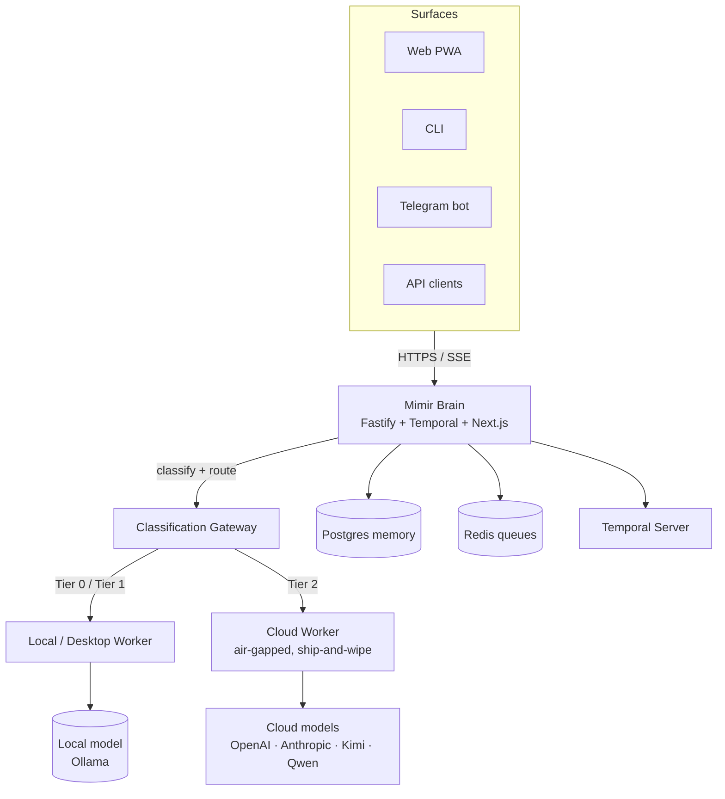
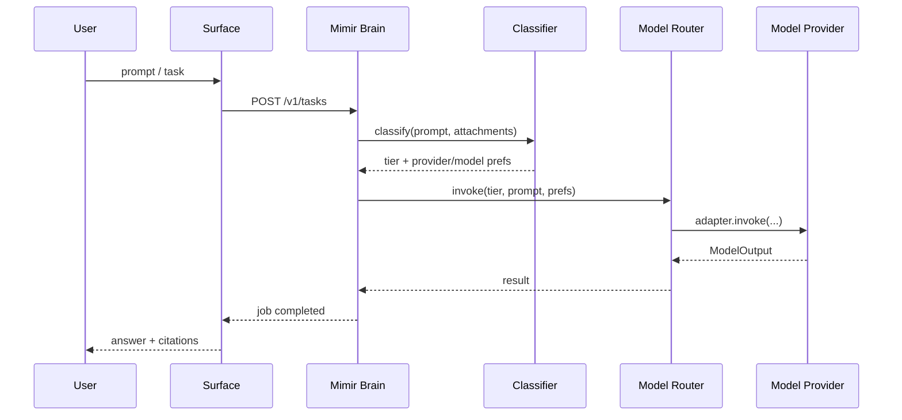
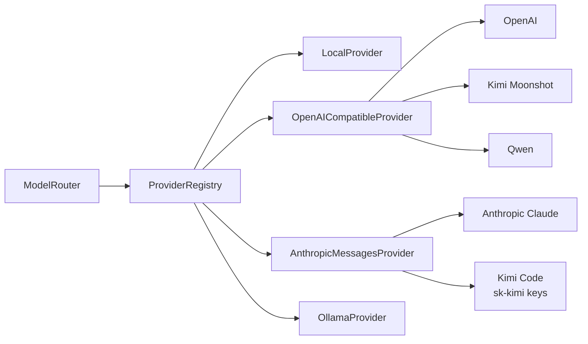

<div align="center">

# 🧠 Mimir

### Many private minds, one well of wisdom.

**A privacy‑tiered AI orchestration mesh that turns your own devices (plus optional cloud) into a single, trustworthy "brain" you drive from a chat box or a UI — simple enough for a kid, deep enough for an engineer.**

`status: pre‑alpha (Milestone 0)` · `license: TBD (open‑core)` · `stack: TypeScript + Python + Temporal` · `docs: this README + ROADMAP.md`

</div>

---

## Table of contents

1. [TL;DR](#tldr)
2. [The problem Mimir exists to solve](#the-problem-mimir-exists-to-solve)
3. [What Mimir is](#what-mimir-is)
4. [Who it's for](#who-its-for)
5. [The two promises](#the-two-promises)
6. [Core concepts & glossary](#core-concepts--glossary)
7. [Privacy tiers](#privacy-tiers)
8. [Architecture at a glance](#architecture-at-a-glance)
9. [Feature tour](#feature-tour)
10. [The stack (and why)](#the-stack-and-why)
11. [Repository layout](#repository-layout)
12. [Quickstart](#quickstart)
13. [Using Mimir: prompts *and* UI](#using-mimir-prompts-and-ui)
14. [Connectors](#connectors)
15. [Surfaces & access points](#surfaces--access-points)
16. [How Mimir compares](#how-mimir-compares)
16. [Security & privacy posture](#security--privacy-posture)
17. [Project status & roadmap](#project-status--roadmap)
18. [Contributing](#contributing)
19. [FAQ](#faq)
20. [A note on the name](#a-note-on-the-name)
21. [License & acknowledgements](#license--acknowledgements)

---

## TL;DR

Mimir is **one always‑on "brain"** that holds your memory and orchestrates work across a mesh of
nodes you control — your laptop, a desktop worker, an optional ephemeral cloud worker, and your
phone — while keeping sensitive data on **hardware you own**. You talk to it like a chat assistant
or click through a friendly UI; under the hood it routes every request to the right model and the
right machine based on **how private the data is**, never sends sensitive data off your tier, and
**cites its sources instead of hallucinating**.

Mimir is a **self‑contained system** with its own orchestration and execution engine. It is
**inspired by** the agent‑runtime research that produced projects like Hermes (Nous) — especially
its broad connector/tool surface and skill model — but Mimir **reimplements and improves** those
ideas to build a privacy‑tiered, multi‑node, governed mesh. **Mimir owns both the bridge and the
engine room.**

It exists for the gap that kills most agent projects: not the model, but **orchestration,
reliability, cost, and governance.** Industry data: ~**88% of AI‑agent projects fail before
production** and Gartner expects **40%+ to be cancelled by 2027** — and the causes are
systems‑engineering, not the LLM (see `ROADMAP.md` §2 + Sources).

---

## The problem Mimir exists to solve

Building one agent in a demo is easy. Running a *fleet* of them reliably, privately, affordably,
and accountably is where everyone falls over. The documented failure modes, repeatedly, are:

- **Orchestration complexity** — coordinating multiple agents, shared state, and tool calls without
  loops, conflicts, or lost work.
- **Reliability & observability** — agents that "work, then mysteriously don't," with cryptic logs
  and no way to trace a failure across machines and providers.
- **Cost unpredictability** — a runaway loop can burn thousands of dollars of tokens unnoticed
  (a real, documented incident: ~$47K over 11 days before anyone saw the bill).
- **Governance & compliance friction** — no audit trail, no policy enforcement, no data‑residency
  story; security review kills the project before it ships.
- **Privacy/jurisdiction** — sending proprietary code and documents to whatever model is cheapest,
  with no classification or routing.

Mimir is built **architecturally around these failure modes** — durable orchestration, deterministic
limits, sandboxed execution, a cryptographic audit trail, privacy‑tiered routing, and cost
governance — rather than hoping the next model release makes them go away.

> **Honest scope (from our own validation):** Mimir eliminates the *infrastructure‑class* reasons
> agent projects die. It does not fix bad prompts or a team's lack of domain expertise. We say
> "we eliminate the infrastructure reasons agent projects die," not "we fix the 88%." See
> `hermesh_validation.agent.final.md`.

---

## What Mimir is

In Norse myth, **Mímir** is the wisest being — keeper of the **Well of Wisdom** at the roots of
Yggdrasil — and after he is beheaded, Odin preserves his head and **consults it for counsel**.
That is the product in one image: **a preserved mind you query for grounded knowledge**, fed by a
well of memory, served by a fleet of nodes acting as one.

Concretely, Mimir is:

- **A brain** — an always‑on orchestrator on your most trusted machine that owns the authoritative
  memory and decides *what runs where*.
- **A mesh** — your desktop (woken on demand), an optional air‑gapped cloud worker, and your phone,
  all joined privately and coordinated as a single system.
- **A self-contained engine** — Mimir implements its own model providers, tool registry, skill
  runtime, connector gateway, sandboxing, cron/routines, and subagent delegation. It can borrow
  *ideas* from Hermes, but it does not depend on the Hermes runtime.
- **A duo of models** — a **workhorse** that builds and executes, and a **reviewer/architect** that
  checks, optimizes, and plans — plus a **local model** so the brain still works offline.
- **A memory** — a private, cited knowledge base + graph memory you can rewind like a time machine.
- **A control surface** — usable from a chat prompt *or* a friendly web/mobile UI, with the same
  power available either way.

**If you are skimming one paragraph:** Mimir is inspired by the breadth of agent runtimes like
Hermes, but it is a standalone product. It implements its own connectors, tools, skills, sandboxes,
and model adapters, then wraps them with privacy tiers, audit, cost governance, and multi‑surface
UI. We **improve the engine where it needs oil and rebuild parts when Mimir's requirements demand
it** — there is no hidden Hermes runtime underneath.

---

## Who it's for

| Persona | What they get |
|---|---|
| **The solo power user** ("a powerful computer in my back pocket") | One brain that remembers everything, runs heavy jobs on your desktop on demand, and answers from your own data — controllable from your phone. |
| **The small team** | A shared, governed brain with cost ceilings, an audit trail, and connectors to the tools they already use (GitHub, mail, docs, chat). |
| **The enterprise (later)** | Multi‑tenant isolation, SSO/SCIM, policy‑as‑code governance, data residency, and an immutable audit trail — built on the same core, not a fork. |

> Strategic note: we **lead with the developer/power‑user** and keep the personal mesh as
> open‑source proof‑of‑capability; enterprise features are architected‑for, not bolted‑on. The
> commercial sequencing and the reasoning are in `ROADMAP.md` §8 (Go/No‑Go gate).

---

## The two promises

These define Mimir and are **hard constraints on every feature**.

### 1) Kid‑simple → expert‑complex

Every capability works from **both a UI and a plain‑English prompt**, and the experience scales
with you:

- **Kid mode (default):** one input box, smart defaults, plain language. *"Make me a summary of this
  folder"* → it does the right thing, shows the result, done.
- **Power mode (progressive):** reveal the cutlist of steps, swap models, set budgets, edit the
  policy, branch the memory, wire a connector, inspect the audit trail.

> *As simple as you want; as complex as you want.* A 10‑year‑old can use the front door; a staff
> engineer can open every panel.

### 2) RAG‑first, never hallucinate

For anything that **references data**, Mimir **retrieves and cites real sources** instead of
free‑generating, and will say *"I don't know / not in my sources"* rather than invent. Every answer
can show **provenance** in the audit log. Generic generation is used only where appropriate (e.g.
brainstorming), never where a citation is expected.

```
You:   What did we decide about the cache key format last week?
Mimir: Tenant-prefixed keys — `tenant:{id}:{resource}` — decided in ADR-0007 (2026-06-18).
       📎 Sources: docs/adr/0007-cache-keys.md · memory/session-2026-06-18#msg-42
       (If this weren't in my sources, I'd tell you I don't know.)
```

---

## Core concepts & glossary

| Term | Meaning |
|---|---|
| **Brain** | The always‑on orchestrator that owns authoritative memory and routes work. Lives on Tier 0. |
| **Node** | Any machine in the mesh: laptop (brain), desktop (worker), cloud (ephemeral worker), phone (control). |
| **Mesh** | All nodes joined privately (Tailscale), coordinated as one system. |
| **Well** | The shared memory/knowledge store the brain draws from. |
| **Workhorse** | The model that does the heavy building/execution. |
| **Reviewer** | The model that checks/optimizes/plans the workhorse's output. |
| **Tier** | Privacy class of data/compute: Tier 0 (private), Tier 1 (local), Tier 2 (cloud, ephemeral). |
| **Classification gateway** | Routes each request to the right model/node by data sensitivity. |
| **Routine** | A scheduled or triggered agent job. |
| **Connector** | An integration (GitHub, mail, Airtable, chat apps, …) with its own auth + privacy tier. |
| **Time‑machine** | Branch/rewind/restore of the memory to any past checkpoint. |
| **Fencing epoch** | Monotonic token that guarantees only one valid writer during failover (no split‑brain). |

---

## Privacy tiers

The organizing principle of the whole system.

| Tier | Where it runs | What goes there | Guarantee |
|---|---|---|---|
| **Tier 0 — Private** | Your local brain (laptop) | Sensitive/proprietary data; the authoritative memory | Never leaves your hardware; encrypted at rest |
| **Tier 1 — Local compute** | Desktop worker (wake‑on‑LAN) | Heavy local jobs; no sensitive persistence | Stays on your LAN/tailnet |
| **Tier 2 — Cloud (ephemeral)** | Optional cloud worker, **air‑gapped from the private mesh** | Public/non‑sensitive automations only | Ship‑and‑wipe; instance‑store/tmpfs; cannot reach Tier 0/1 |

A **data‑classification gateway** inspects each request and routes it: public/stripped → the cheap
workhorse; sensitive → a private or local model. **Policy‑as‑code** makes the rules explicit,
versioned, and auditable.

---

## Architecture at a glance

```
        Phone (chat) ─┐
                      ▼
   Desktop ─────▶  LAPTOP = BRAIN  ◀────── you, from anywhere (Tailscale, zero-trust ACLs)
   (Tier 1, WoL)     ┌──────────────────────────────────────────────────────────────┐
                     │  Mimir brain — governance, memory, orchestration, surfaces    │
                     │  (Fastify + Temporal + Next.js + Clerk + RBAC)                │
                     │  • memory: Postgres authoritative + LibSQL embedded replicas  │
                     │  • orchestration: Temporal workflows                          │
                     │  • classification gateway (T0/T1/T2 routing)                  │
                     │  • RAG + graph memory + time-machine                          │
                     │  • policy-as-code + immutable hash-chain audit                │
                     │  • cost governance + budget throttle                          │
                     │  • RBAC, multi-tenancy, sessions, approvals                   │
                     └────────────────────────┬─────────────────────────────────────┘
                                              │ internal RPC
                                              ▼
                     ┌──────────────────────────────────────────────────────────────┐
                     │  Mimir execution engine                                       │
                     │  • model providers + adapters (local + cloud)                │
                     │  • tool registry + skill runtime                             │
                     │  • connectors / chat gateways / crawlers                     │
                     │  • image/video generation, TTS/STT                         │
                     │  • subagent delegation, cron, sandboxing (gVisor)            │
                     │  • embedded FTS + vector memory                              │
                     └────────────────────────┬─────────────────────────────────────┘
                                              │ dispatch
                                              ▼
                     Cloud worker (Tier 2, air-gapped, ship-and-wipe; returns via short-lived signed webhook)
```

Mimir owns both the **governance/product layer** and the **execution engine**. The engine is
inspired by the breadth of agent runtimes like Hermes, but it is implemented inside Mimir so that
classification, audit, cost control, and tier enforcement can be applied at every boundary.

- **Single writer, zero‑loss failover:** the brain is the only writer; LibSQL embedded replicas let
  the desktop **auto‑promote via a fencing epoch** if the laptop dies — no split‑brain, no data loss.
- **Durable orchestration:** Temporal gives retries, idempotency, and crash‑safe workflows for free.
- **Safe execution:** generated/untrusted code runs in **gVisor** (user‑space kernel) — prompt
  injection can't escape to the host.
- **Inspired by, not built on, Hermes:** Mimir's connector/tool/skill surface is inspired by
  projects like Hermes (Nous), but Mimir implements its own runtime. The privacy tiers, multi‑node
  mesh, multi‑tenancy, immutable audit, and cost governance are Mimir's own (see `ROADMAP.md` §5.1).

### Visual architecture



### Request lifecycle



### Model adapter registry



The registry is provider-agnostic: each adapter implements the same `ModelProvider` interface, and
the `ModelRouter` picks the first available candidate for the requested privacy tier (or an explicit
provider/model override). `MODEL_PROVIDER_T0/T1/T2` env vars configure which providers are tried per
tier; Kimi Code keys (`sk-kimi-*`) are auto-detected and routed to the Kimi Code Anthropic-compatible
endpoint.

Deep architecture: `ROADMAP.md` §3, §5.1, §6–§14.

---

## Feature tour

| Surface | What it does |
|---|---|
| **Console** | Chat with the brain — streamed, with **model + trust + privacy‑tier badges** on every answer. |
| **Status / topology** | A live **visual map** of your nodes (green/amber/red), queue depth, costs — not a JSON dump. |
| **Tasks / Kanban** | One unified stream of scheduled + ad‑hoc work; blocked‑offline states; idempotent retry. |
| **Approvals** | Humane tap‑to‑approve for risky actions: blast‑radius preview, tiered timeouts, PIN/biometric. |
| **Reports** | Browse + **full‑text and semantic search**; 4‑channel delivery (toast / chat / web / email). |
| **Knowledge / Docs** | Ingest docs & codebases for RAG; **screenshots‑as‑references** gallery for "look at my screen." |
| **Memory** | **Time‑machine** (branch/rewind) + an interactive **graph‑memory** viewer. |
| **Governance / Audit** | Policy‑as‑code editor + a tamper‑evident **hash‑chain audit log** with temporal replay. |
| **Cost / Budget** | Live burn‑rate, budgets, auto‑throttle; per‑task pre‑flight cost estimate. |
| **Connectors** | One place to connect GitHub, mail, Airtable, contacts, docs, screenshots + Discord/Slack/Telegram. Mimir implements the connector engines (design inspired by Hermes) and adds tier labels, credential vaulting, and approval gating. |
| **Skills / Tools / Subagents** | Reusable capabilities, custom tools, and delegated subagent runs — executed by Mimir's own engine, discovered, versioned, and governed inside Mimir. |
| **Media generation & speech** | Image/video generation, text‑to‑speech, speech‑to‑text — routed by Mimir's tier and budget rules. |
| **Emergency HALT** | Always‑one‑tap kill switch (and auto circuit‑breaker on runaway cost/spawn). |

---

## Surfaces & access points

These are **Mimir's own access points**. They are thin, governance-aware clients that always route
through the Mimir brain before any work is executed by Mimir's engine.

| Surface | What it's for |
|---|---|
| **Web PWA** | The full dual UI — kid-simple default, expert panels on demand. |
| **CLI** | Scriptable, terminal-first control for power users and CI. |
| **Browser extension** | Capture pages, screenshots, and selected text as references; trigger actions from any tab. |
| **Telegram bot** | Free chat UI on your phone — approvals, status, voice notes, quick queries. |
| **Electron app** | A dedicated desktop chat client with deep OS integration and screen awareness. |
| **API** | `/v1/*` REST/SSE for custom integrations and other agents. |

No matter which surface you use, the path is the same:

```
You → Mimir surface → Mimir brain (classify, route, audit, approve, budget) → Mimir execution engine → result → Mimir brain → You
```

All surfaces share the same brain, memory, and governance — the device in your pocket has the same authority model as the node in the data center.

---

## The stack (and why)

Matches our proven `ai-video-editor` bar so we don't relearn lessons.

| Layer | Choice | Why |
|---|---|---|
| Web | **Next.js 15** · TypeScript · Tailwind · **shadcn/ui** · **Clerk** · PWA | Modern DX, installable on phone, batteries‑included auth |
| API | **Fastify** · **Temporal** · **Drizzle** · Postgres · Redis | Fast, typed; Temporal = durable orchestration; Drizzle = typed SQL + migrations |
| Workers | **Python** (uv workspace) | Best ecosystem for model/RAG/render work |
| Shared truth | `@mimir/shared-types` (**Zod**) + `@mimir/contracts` (OpenAPI→client) | One source of truth; no schema drift between web/api |
| Quality | pnpm + uv · ESLint/Biome · mypy · Vitest/pytest · Playwright · Codecov · Husky + lint‑staged · **CodeQL + dependency‑review (no Dependabot)** · CodeRabbit + human review | The rails that keep 10+ contributors honest |

---

## Repository layout

```
mimir/                 # org: mimir-mesh · package scope: @mimir/*
├── apps/
│   ├── web/           # Next.js PWA            → apps/web/AGENTS.md
│   └── api/           # Fastify + Temporal     → apps/api/AGENTS.md
├── packages/
│   ├── shared-types/  # Zod schemas/enums/errors — SINGLE SOURCE OF TRUTH
│   ├── contracts/     # OpenAPI → generated typed client
│   └── eslint-config/ # shared lint/format rules
├── services/          # Python workers (uv)    → services/AGENTS.md
├── infra/             # Docker, Temporal, deploy → infra/AGENTS.md
├── tests/             # cross-service integration/e2e
├── docs/              # ARCHITECTURE, API, DEVELOPMENT, TESTING, DEPLOYMENT, adr/, rfcs/, threat-model
├── .github/           # workflows + ISSUE_TEMPLATE (bug, feature, decision) + PR template + CODEOWNERS + labeler
├── .husky/  .lintstagedrc  .coderabbit.yaml  Makefile
├── AGENTS.md  CLAUDE.md(@AGENTS.md)  CONTRIBUTING.md  SECURITY.md  CODE_OF_CONDUCT.md  CHANGELOG.md
├── README.md          # you are here
└── ROADMAP.md         # the detailed plan: features, milestones, deadlines, risks, analytics, go/no-go
```

---

## Quickstart

> Lands fully in **Milestone 1**; shown here so the shape is clear.

**Prerequisites:** Node 20+, pnpm 9+, Python 3.11+, uv, Docker.

```bash
git clone https://github.com/mimir-mesh/mimir.git
cd mimir
pnpm install                 # JS workspaces
uv sync                      # Python workers
cp .env.example .env         # fill in keys (or use the secrets vault)
docker compose up -d         # Postgres, Redis, Temporal
pnpm dev                     # api + web (http://localhost:3000)
```

Then open `http://localhost:3000`, sign in, and say hello to your brain.

---

## Using Mimir: prompts *and* UI

Everything is dual‑surface. Examples:

| You want to… | Prompt | UI |
|---|---|---|
| Summarize a folder of docs | *"Summarize everything in /docs and cite sources."* | Knowledge → select folder → **Summarize** |
| Run a heavy job on the desktop | *"Render this on the desktop and ping me when done."* | Tasks → New → target **Desktop** |
| Approve a risky action | reply *"approve 7‑A4F"* in chat | Approvals → tap **Approve** (PIN) |
| Check spend | *"What did I spend today?"* | Cost widget (always visible) |
| Rewind memory | *"What did I know last Tuesday?"* | Memory → Time‑machine → pick checkpoint |

---

## Connectors

GitHub · Mail (Gmail / MS Graph) · Airtable · Contacts · Docs · Screenshots‑as‑references ·
**Discord** · **Slack** · **Telegram** (each is both an auth'd connector *and*, for the chat apps,
an embedded surface inside Mimir). Each connector declares the **privacy tier** its data is treated
as. Detailed per‑connector specs: `ROADMAP.md` §Connectors.

---

## How Mimir compares

*(Stars/figures are cited in `ROADMAP.md` Sources; point‑in‑time.)*

| | LangChain | CrewAI | Mastra | Dify | **Mimir** |
|---|---|---|---|---|---|
| Privacy‑tiered routing | ❌ | ❌ | ❌ | ❌ | ✅ core |
| Personal device mesh (WoL, ship‑and‑wipe) | ❌ | ❌ | ❌ | ❌ | ✅ core |
| Durable orchestration | partial | ❌ | partial | partial | ✅ Temporal |
| Cost governance (budgets + throttle) | monitoring | ❌ | ❌ | basic | ✅ first‑class |
| Immutable audit (hash‑chain + replay) | logs | basic | basic | logs | ✅ |
| RAG‑first / cite‑or‑abstain default | opt‑in | opt‑in | opt‑in | opt‑in | ✅ default |
| Kid‑simple → expert UI | dev‑only | dev‑only | dev‑only | visual | ✅ both |

Our wedge is **"instantly deterministic, production‑safe DX"** — we target developers hitting
production walls with the above. (Strategy + the brutal honest caveats: `ROADMAP.md` §8.)

---

## Security & privacy posture

- **Untrusted code is sandboxed** (gVisor user‑space kernel) — prompt injection cannot reach the host.
- **Zero‑trust network** (Tailscale tag ACLs); the cloud worker is **air‑gapped** from the private mesh.
- **No static SSH keys** — ephemeral SSH certificates (short‑lived).
- **Encryption at rest** (LUKS + SQLCipher); secrets in a vault, never plaintext in the repo.
- **No auto‑execute from chat** without a second factor; risky actions require explicit approval.
- **Privacy tiers enforced**, not promised — cross‑tier/cross‑tenant isolation is a required CI test.

Responsible disclosure: see `SECURITY.md` (lands in M0). Known open defects are tracked openly in
`ROADMAP.md` §6 (we close all critical/high **before** any reliability/governance claim).

---

## Project status & roadmap

**Pre‑alpha — Milestone 0** (repo, docs, CI rails, conventions; *before* feature code, so the team
builds on solid ground). The full plan — features table, M0–M10 with deadlines, risk register,
analytics/KPIs/SLOs, and the commercialization go/no‑go gate — is in **[`ROADMAP.md`](./ROADMAP.md)**.

---

## Contributing

Every change starts with a **descriptive issue** (Problem → Proposed solution → Acceptance criteria
→ Test plan → Out of scope), then a **small PR** (≤ ~400 LoC) linked `Closes #NN`, green CI, one
review, squash‑merge. Big features = a `decision` (ADR) issue + a *stack* of small PRs — never one
mega‑PR. Read **`AGENTS.md`** first; full flow in **`CONTRIBUTING.md`** (both land in M0).

We model our process on the best in open source: Google's eng‑practices (small CLs), Stripe/Google
AIP (API design), FastAPI/Pydantic (typed + tested), Supabase/Astro (contributor docs), and
Temporal/Prefect (durable orchestration).

---

## FAQ

**Is my data sent to the cloud?** Only Tier‑2 (public/non‑sensitive) work touches the optional cloud
worker, which is air‑gapped and wiped after each job. Sensitive data stays on Tier 0/1.

**Do I need all the machines?** No. Mimir runs on a single laptop; desktop/cloud/phone are optional
nodes you add when you want more.

**Will it hallucinate?** For "reference the data" tasks it cites sources or says it doesn't know.
That's a core principle, not a setting.

**Is it production‑ready?** Not yet — pre‑alpha. We are deliberately **hardening and dogfooding
before** making reliability claims (see `ROADMAP.md` §8).

**Why two models?** A workhorse to build fast/cheap, a reviewer to keep quality high — plus a local
model so you're never fully offline.

**What exactly does Hermes do and what does Mimir do?**
Hermes (Nous) is an **inspiration and reference** for Mimir's execution engine. Mimir implements its
own model adapters, tool registry, skill runtime, connector gateway, sandboxing, cron/routines,
subagent delegation, and media generation/speech modules. Hermes showed what a broad agent surface
should look like; Mimir builds a privacy‑tiered, governed, multi‑node version of that surface from
the ground up. **Mimir is both the bridge and the engine room.**

**Does Mimir reimplement connectors, models, or skills?**
Yes, where Mimir's requirements demand it. Mimir's engine is self‑contained. We borrow *ideas* from
Hermes and similar runtimes, but the code that runs inside Mimir is Mimir's own, so that privacy
tiers, audit, cost control, and tenant isolation can be enforced at every layer.

**Can I use Hermes directly with Mimir?**
No. Hermes is not a runtime dependency of Mimir. Mimir is a standalone product.

**Why does Mimir have its own chat UI?**
Mimir's chat UI is a governance‑aware product surface: every message is classified, audited,
budgeted, and routed through Mimir's tier rules before Mimir's own engine executes anything. The
same is true for the CLI, browser extension, Electron app, Telegram bot, and API.

**What happens to a request inside Mimir?**
1. A surface (web, CLI, etc.) sends the request to the Mimir brain.
2. The classification gateway scores data sensitivity and picks a tier/model.
3. Policy-as-code checks budgets, approvals, RBAC, and tenant isolation.
4. The request is logged to the immutable audit chain.
5. Mimir's own execution engine runs the model/tool/connector/skill/subagent.
6. The result returns through Mimir, is logged, and is delivered back to the surface.

**Are Mimir's connectors different from Hermes's connectors?**
The designs are related because Hermes is a reference, but the code is different. Mimir implements
its own connector engines and adds tier declarations, credential vaulting, per-user approval gating,
audit logging, and a unified discovery UI. A connector that is "Tier 2 only" in Mimir is enforced by
Mimir's own policy layer.

---

## A note on the name

**Mimir** = this product/mesh/brand — the privacy‑tiered AI orchestration mesh you interact with.
**Hermes** = an open‑source agent runtime by Nous that **inspired** Mimir's connector/tool/skill
surface. It is *not* a runtime dependency, *not* the public product name, and *not* something Mimir
invokes internally. The names are intentionally different to avoid confusion with the Nous "Hermes"
model family and the Hermès fashion trademark. Mimir is also distinct from **Grafana Mimir** (an
observability TSDB); org/scope/domain are differentiated accordingly.

When reading this codebase, assume this boundary unless a file explicitly says otherwise:
**Mimir owns the engine room and the bridge. Hermes is a respected ancestor, not a hidden engine.**

## License & acknowledgements

License: **TBD** (open‑core direction — see `ROADMAP.md` §Commercialization). Built on the shoulders
of the open‑source community — Temporal, Fastify, Next.js, Drizzle, Zod, LibSQL, gVisor, Tailscale,
and the agent‑ecosystem research that shaped this plan (cited in `ROADMAP.md` Sources).

<div align="center">

**Mimir** — *consult the well.*

</div>
